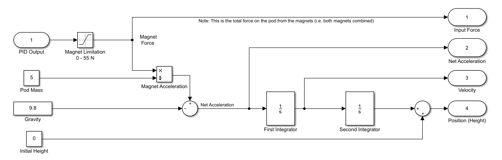
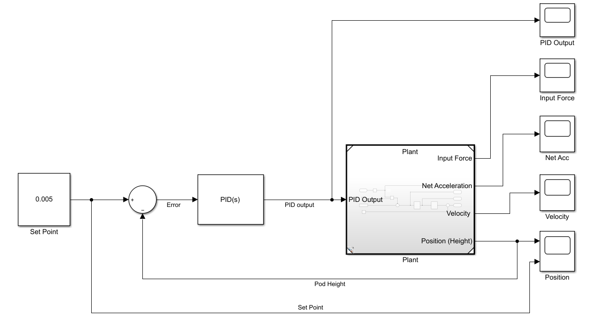
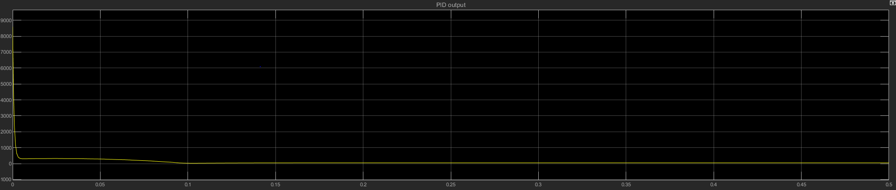
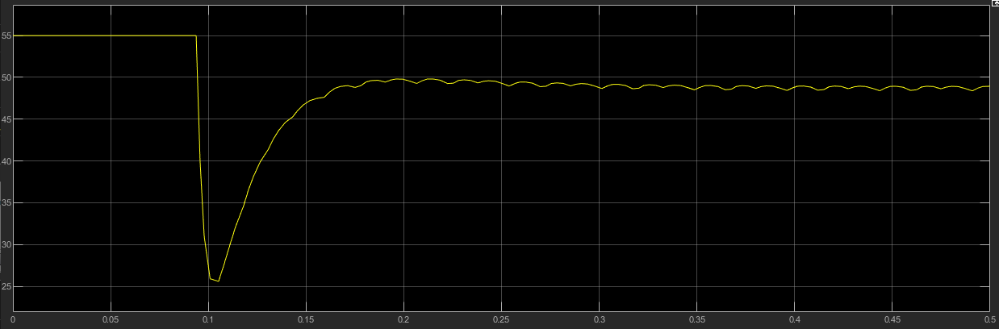
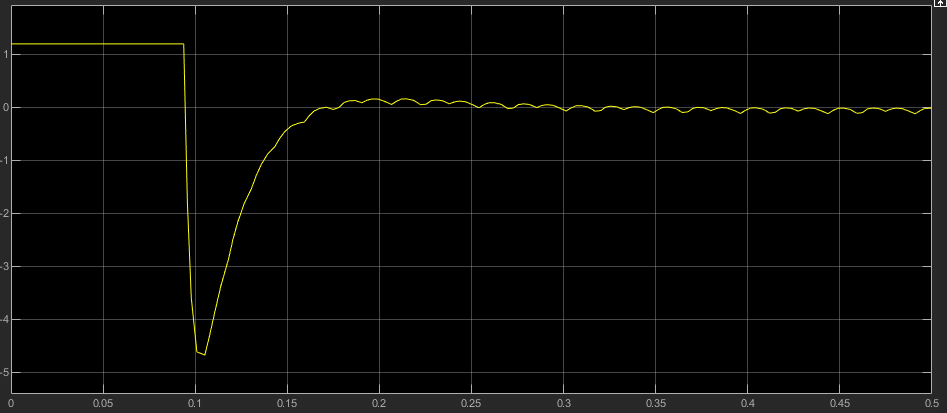
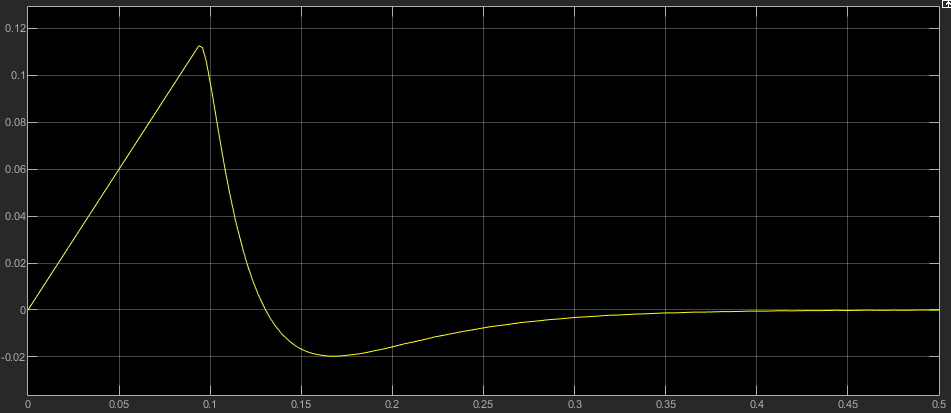
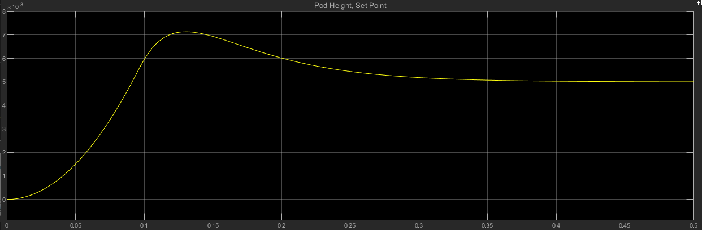

<b><h1> Electromagnetic Suspension </h1></b>

# Kinematics Model

This following model in Simulink is used to simulate the hyperloop pod. 

The model takes in an input force from a PID controller and outputs the following:
- The force exerted on the pod
- The acceleration of the pod
- The velocity of the pod
- The position of the pod

The plant was put in the following model, to tune a PID controller:

These were the plant parameters:

| Parameter                          | Value |
| -------------                      | -----:|
| Maximum Possible Magnetic Force    |  55 N |
| Minimum Possible Magnetic Force    |  0 N  |
| Pod Mass                           |  5 kg |
| Initial Height                     |  0 m  |
| Simulation Time                    | 0.5 s |

## Output

These were the tuned PID values:

| Parameter                           | Value            |
| -------------                       | -----:           |
| Proportional Gain ( Kp ) | 58024.7697722311 |
| Integral Gain ( Ki )     | 679104.182905479 |
| Derivative Gain ( Kd )   | 1217.40122699774 |
| Filter Coefficient ( N )            | 1363.49256355405 |

The sytem was simulated for the time outlined above. The PID controller outputed the following in Newtons:

The plant limited the PID output based on the magnetic force capabilities outlined above to the following graph (N):

This lead to the total acceleration on the pod (ms-2):

The velocity of the pod over this period was (ms-1):

This graph shows the position of the pod over the simulation period, with the blue line at the set point of 5 mm. 

Note the y axis is on the scale of 10-3 meters

